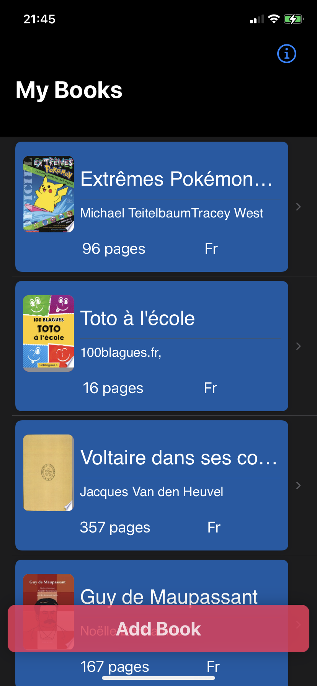
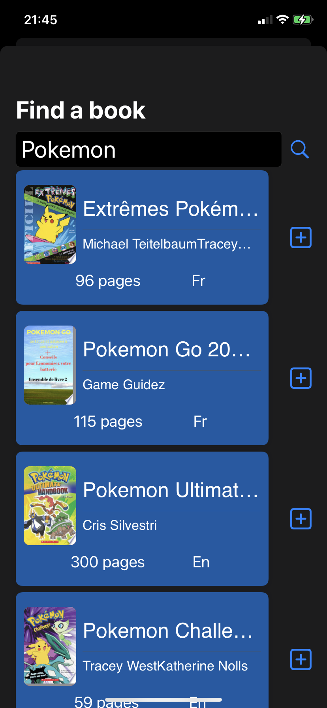
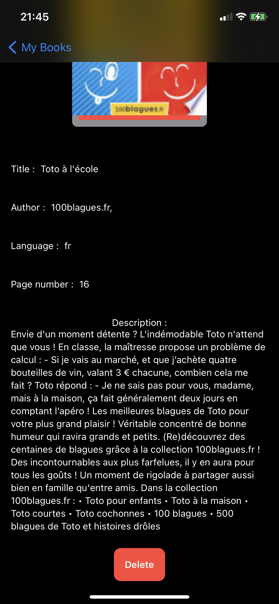
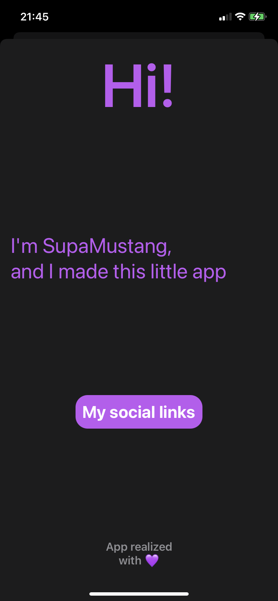

# Projet4AApp

edit :

## Introduction
Welcome to my Projet4A. It's a SwiftUI App ( 2nd iOS app of my life ) that allows you to store your books. I used the google books api to research books. I used the famous [KingFisher](https://github.com/onevcat/Kingfisher) and [SwiftyJSON](https://github.com/SwiftyJSON/SwiftyJSON) libraries.

## Instructions followed
  * Git flow
  * MVVM architecture
  * Data persistence with CoreData
  * Clean architecture
  * Api rest
  * List of element (Books)
  * SwiftUI and Swift

## Functionalities with images
At the begining I wanted to create an app to track my reading speed with a chronometer in the app and indicate you your current page at the end of a reading session. To deliver a clean and functional work I have chosen to create an app to only store books. It's a student project for my 4th year of engineering at ESIEA France.

#### Main view

#### Research view

#### Detail view

#### Info view

## Links
I used a lot of websites to understand some programming and development concept in SwiftUI

#### To understand some concepts in SwiftUI:
* https://swiftwithmajid.com/
* https://www.hackingwithswift.com/read/0/17/properties
* https://stackoverflow.com/questions/56437335/go-to-a-new-view-using-swiftui
* https://dev.to/thetealpickle/swiftui-state-and-binding-23j5
* https://www.youtube.com/channel/UCjDg7LaaMzmuhj6I1jTzb1Q
* https://www.youtube.com/channel/UCuP2vJ6kRutQBfRmdcI92mA
* https://www.youtube.com/channel/UCmJi5RdDLgzvkl3Ly0DRMlQ

#### To understand git:
* https://guides.github.com/introduction/flow/
* https://nvie.com/posts/a-successful-git-branching-model/
* https://www.git-tower.com/help/guides/integration/git-flow/windows
* https://medium.com/datadriveninvestor/git-rebase-vs-merge-cc5199edd77c

#### To use Markdown :
* https://guides.github.com/features/mastering-markdown/

#### To understand Clean Architecture for SwiftUI :
* https://nalexn.github.io/clean-architecture-swiftui/
